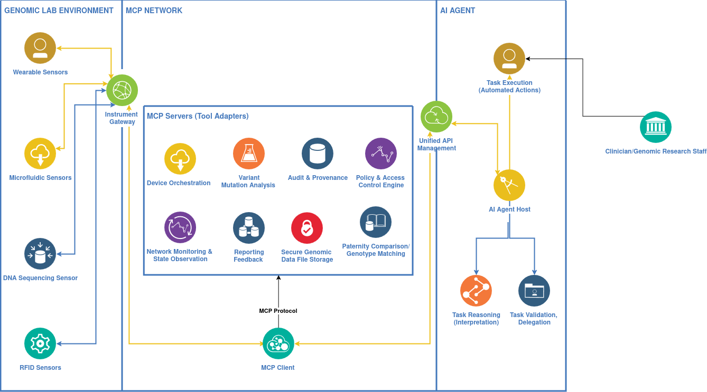

# Project: LLMs for Users Intents Task Orchestration for Genomic Research Lab Environment

## 1. Introduction

Modern genomic research laboratories have integrated gradually into smart workspace environments, with the integration of heterogeneous IoT devices and services [2,3,6]. However, researchers and laboratory staff, usually non-IT users, require intuitive ways to express their intents, without manually configuring each device. Large Language Models (LLMs) have emphasized the capabilities in reasoning, planning, and task orchestration, providing a promising methodology for translating natural user intents into executable laboratory operations [13,14]. 

This project aims to develop an **LLM-driven orchestration engine** [1,6] for genomic research laboratories. The system enables clinicians to interact with genomic datasets, IoT-connected sequencing devices, and AI models through natural language queries, automating data retrieval, analysis, and workflow execution [7]. By combining real-time deployment tracking, AI-assisted reasoning, and optimized MCP workflow orchestration, the system ensures accurate, efficient, and secure genomic analysis.

## 2. Context and Motivation

Current genomic research pipelines often involve multiple stages: data collection via sequencing devices, real-time monitoring of sensor outputs, processing in computational intelligence models, and analysis in cloud or edge computing environments. These processes are typically managed through rigid software tools, which limits flexibility and accessibility for clinicians. A system that allows clinicians to interact via **natural language intents** can dramatically improve usability and efficiency. Therefore, intents in DNA sequencing analysis, for example, could be utilized for task automation:

> "Retrieve gene sequences for patient X and perform paternity comparison"`

> "Analyze genomic variants associated with condition Y and summarize results"

LLMs can interpret these intents and generate structured workflows considering environmental context, device status, and system constraints [1,3]. This approach enables autonomous orchestration of IoT services, improving efficiency, energy management, and user comfort while reducing human intervention [2,4]. Our platform is inspired by the SmartIntent [2] and Hospital 4.0 [14] architecture, which provides a serverless, LLM-oriented framework for natural-language-driven control and orchestration of AIoT-enabled environments. Following this approach, our system is designed to translate **high-level user intents** into **actionable device operations** and provide feedback, targeting non-IT users in a **seamless smart ecosystem**. The architecture includes simulated genomic sensors and lab devices to emulate real-world research scenarios, providing a secure, scalable, and **smart workplace environment** for genomic data analysis and task automation.

---

## 3. Objectives

The main objectives of this project are:

- **Intent Understanding:** Interpret natural language commands or speech and map them to structured actions using MCP protocols [6].  
- **Real-Time Deployment Tracking:** Monitor network topology, device availability, service health, and connectivity metrics .  
- **Workflow Generation:** Create actionable workflows satisfying user intents while considering constraints like energy consumption and latency.  
- **Workflow Validation and Execution:** Ensure the feasibility, safety, and correctness of workflows before executing them across the IoT network.  
- **Optimization:** Enhance workflow efficiency and support scalability for future deployments [1,5].

---

## 4. Scenarios
This project leverages concepts from **smart voice assistants, LLMs, and distributed architectures** in AIoT-enabled environments (as inspired by the SmartIntent [2], Hospital 4.0 [14] framework) and applies them to the **genomic research laboratory**. Drawing from research on **IoT–edge computing for healthcare** [11,13], the system is designed to translate **high-level clinician intents** into **actionable workflows** for genomic analysis.

### 4.1 Patient Sample Comparison

Clinicians can request comparisons between genomic samples to investigate relationships, such as paternity, familial connections, or similarity between patients with specific conditions. The system orchestrates IoT-connected sequencing devices and edge processing nodes to perform these comparisons automatically.  
**Example clinician intent:** `"Compare patient X's gene sequence with patient Y's and summarize relevant differences"`

### 4.2 Variant and Mutation Analysis

LLMs interpret clinician queries about specific genomic regions or variants and generate workflows to extract, organize, and report the findings. This supports detection of potential health-related genetic issues without relying on predictive ML models.  
**Example clinician intent:** `"Retrieve variants in the BRCA1 gene for patient Z and highlight potential health risks"`

### 4.3 Laboratory Device Orchestration

LLM-driven workflows can manage lab devices such as sequencers, microfluidic analyzers, and storage units, ensuring tasks are executed efficiently and under proper conditions.  
**Example clinician intent:** `"Schedule sequencing for patient Y and ensure samples are stored at optimal conditions"`

### 4.5 Structured Reporting and Feedback

Clinicians receive structured outputs summarizing genomic comparisons, variant findings, and device execution status. LLM reasoning can also provide human-readable recommendations or highlight notable observations for further investigation.  
**Example clinician intent:** `"Generate a report summarizing gene variants of patient X relevant to cardiovascular health and suggest next steps for review"`

## 5. Architecture

The orchestration engine follows a modular pipeline: 

**Key components include:**
  
- **Instrument Gateway:** Acts as the bridge between laboratory IoT sensors and the MCP network, normalizing raw device data and ensuring secure, structured communication.

- **MCP Servers (Tool Adapters):** Provide standardized access to analytical tools and services—such as device orchestration, variant analysis, genomic file storage, network monitoring, and paternity/genotype matching—through the MCP protocol.

- **MCP Client:** Serves as the communication hub between the AI agent and all MCP servers, enabling the agent to request computations, retrieve data, and orchestrate workflows across the lab environment.

- **Unified API Management:** Coordinates all agent–tool interactions and enforces API policies, rate limits, and security rules across the MCP network.

- **AI Agent Host:** Runs the reasoning, validation, and delegation logic. It interprets clinician requests, generates suitable workflows, validates them, and delegates executable steps to the MCP client.

---

## 6. Core Components

### 6.1 MCP Protocols

Acts as the base orchestration engine  [6,7], coordinating communication between LLMs and IoT devices, and executing validated workflows.

### 6.2 LLM Reasoning Engine

Generates stepwise plans to satisfy user intents. Supports centralized and decentralized coordination strategies. Implements Tree-of-Thought for multi-path planning and Chain-of-Thought [5] for linear reasoning.

### 6.3 Real-Time Deployment Tracker

Monitors device status, service health (CPU, memory, errors), and network metrics (latency, packet loss). This information is fed into the workflow generator for context-aware orchestration [2].

---

## 7. Workflow Generation (Team Member Work Exploration in the next phase)

Workflow planning integrates LLM reasoning with IoT constraints:

- **Tree-of-Thought (ToT):** Explores multiple execution paths to select optimal strategies.  
- **Chain-of-Thought (CoT):** Supports linear reasoning for simpler workflows.  

**Centralized vs. Decentralized Execution:**

- Centralized: A single orchestrator decides all actions.  
- Decentralized: Devices collaboratively execute workflows.  

**Execution constraints:** energy efficiency, latency, device availability, and safety [5].

---

## 8. Future Directions (Focused Paper for Research Development)

- **Enhanced AI Model Integration within MCP:** Incorporate SmartIntent models (architecture, workflow, evaluation) for lab research environment [2].    
- **IoT-based genetic Architecture & Layers:** Adapt workflows in the management of DNA sequencing sensors, microfluidic/wearable/RFID sensors and gene data communication protocols in Internet Gateway and Data Acquisition [11].
- **Heath context scenarios:** Understand the integration of LLMs in the context of biomedical field, specifically the user intent high-to-low level analysis [14].   
- **Blockchain & Smart Contract Integration(optional):** Integrate donor-clinician agreement terms for genomic data access and authorized access control mechanisms [12].

---

## References

[1] LLMind: Orchestrating AI and IoT with LLM for Complex Task Execution. arXiv. Available: https://arxiv.org/pdf/2312.09007  

[2] SmartIntent: A Serverless LLM-Oriented Architecture for Intent-Driven Building Automation. ResearchGate. Available: https://www.researchgate.net/publication/397059674  

[3] LLM Agents for Internet of Things (IoT) Applications. CS598 JY2-Topics in LLM Agents. Available: https://openreview.net/pdf?id=BikB3f8ByV  

[4] A Survey on IoT Application Architectures. MDPI Sensors. Available: https://www.mdpi.com/1424-8220/24/16/5320  

[5] Tree-of-Thought vs Chain-of-Thought for LLMs. arXiv. Available: https://arxiv.org/html/2401.14295v3  

[6] Introduction to Model Context Protocol. Available: https://anthropic.skilljar.com/introduction-to-model-context-protocol

[7] Model Context Protocol (MCP): Landscape, Security Threats, and Future Research Directions. arXiv. Available: https://arxiv.org/pdf/2503.23278

[8] Small stimulation for better understanding ESP32 MQTT. Available: https://wokwi.com/projects/449799275283840001

[9] Orchestration in the Cloud-to-Things
compute continuum: taxonomy, survey
and future directions. Journal of Cloud Computing:
Advances, Systems and Applications. Available: [https://www.mdpi.com/1424-8220/24/16/5320](https://arxiv.org/abs/2309.02172)

[10] A Taxonomy and Survey of Cloud Resource Orchestration Techniques. ACM. Available: https://dl.acm.org/doi/10.1145/3054177

[11] An IoT-Based Computational Intelligence Model to Perform Gene Analytics in Paternity Testing and Comparison for Health 4.0. Journal of Theoretical and Applied Information Technology. Available: [https://www.researchgate.net/profile/Vijay-Arputharaj/publication](https://www.researchgate.net/profile/Vijay-Arputharaj/publication/372809441_AN_IOT-BASED_COMPUTATIONAL_INTELLIGENCE_MODEL_TO_PERFORM_GENE_ANALYTICS_IN_PATERNITY_TESTING_AND_COMPARISON_FOR_HEALTH_40/links/64c93a734ce9131cd57d5cb2/AN-IOT-BASED-COMPUTATIONAL-INTELLIGENCE-MODEL-TO-PERFORM-GENE-ANALYTICS-IN-PATERNITY-TESTING-AND-COMPARISON-FOR-HEALTH-40.pdf?__cf_chl_tk=FBZhMjr0Gl3WpIEQ5mBgiqqOPpO6C_HdUVGlTXswqgA-1765459717-1.0.1.1-1S7HVdLCBWGhhvRh2MrnipcVHh6bU81rwAWyMAvz_zk)

[12] Blockchain and smart contract for IoT
enabled smart agriculture. PeerJ. Available: https://peerj.com/articles/cs-407.pdf

[13] Evaluation of IoT-Enabled hybrid model for genome sequence analysis of patients in healthcare 4.0. ScienceDirect. Available: https://www.sciencedirect.com/science/article/pii/S2665917423000156

[14] Toward Intent-Based Network Automation for
Smart Environments: A Healthcare 4.0 Use Case. IEEE. Available: https://ieeexplore.ieee.org/stamp/stamp.jsp?arnumber=10336815
